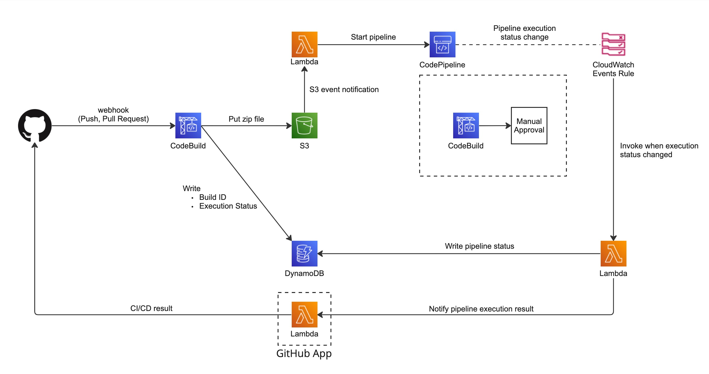

# code-pipeline-github-webhook-cdk

2024/2 時点で CodePipeline 単体では実現できない事前にブランチ名の決まっていない不特定多数のブランチへの Push をトリガーの CodePipeline のワークフローを実行するサンプルです。

CDK にて AWS リソースの定義をしています。

GitHub への CI/CD 結果の送信方法が若干異なりますが、CloudFormation にて同様の内容を実施しているサンプルは下記です。

https://github.com/t-maru078/code-pipeline-github-webhook

このサンプルでは GitHub リポジトリの main, develop ブランチ及び tag 以外の Push, Pull Request をトリガーとして CodePipeline のワークフローが起動されます。

Pipeline のワークフローは CodeBuild で実行される Unit test (Unit test 用の CodeBuild プロジェクトのみで実際に Unit test は回していません) のワークフローと、手動承認アクションを組み合わせた例になっていますが、必要に応じてワークフロー内容の変更や stage の追加などを実施してカスタマイズ可能です。

## 構成図



## AWS へのデプロイ

※ Lambda Function を定義するために `aws-cdk-lib/aws-lambda-nodejs` モジュールの `NodejsFunction` を使用しているため、cdk synth 及び deploy をする環境で Docker が使用できないとエラーになりますのでご注意ください。

事前に下記の作業が必要です。

1. AWS CLI のインストール。詳細は下記の公式ドキュメント参照。

   https://docs.aws.amazon.com/ja_jp/cli/latest/userguide/getting-started-install.html

1. GitHub と AWS を接続するために AWS Management Console で下記の手順を実施

   1. CodeBuild の console を開き `Create build project` ボタンを押す
   1. Source provider のドロップダウンから `GitHub` を選択する
   1. `Connect using OAuth`, `Connect with a GitHub personal access token` のいずれかを選択して GitHub と接続
   1. console 最下部の `cancel` ボタンを押して `Create build project` のウィザードを閉じる

1. GitHub App の作成

   1. GitHub の Web Console の右上のプロフィールをクリックして `Settings` メニューをクリック
   1. `Developer settings` メニューをクリック
   1. サイドメニューが `GitHub Apps` となっていることを確認し右上の `New GitHub App` をクリック
   1. 以下を設定した GitHub App を作成

      1. GitHub App name: 任意の名前を設定
      1. Homepage URL: 任意のページを設定
      1. Webhook のセクションで `Active` のチェックを外す
      1. Permissions で以下の権限を追加

         - Repository permissions: `Checks` の `Read and write` を選択

      1. `Only on this account` を選択

1. 作成した GitHub App の設定ページで `Private key` を生成

1. 取得した Private key を base64 エンコードし、以下の形式で Secrets Manager に登録

   - Secret type: `Other type of secret`
   - Key/value pairs で以下の値を設定

     ```
     GITHUB_APP_ID: 作成した GitHub App の ID。GitHub App の設定ページなどで確認できる。
     GITHUB_APP_PRIVATE_KEY: Private key を base64 エンコードした文字列
     ```

     - Mac の場合は `cat xxx.pem | base64 | pbcopy` でクリップボードにコピーされるのでそれをそのまま value の field に貼り付け (xxx.pem は Private key のファイル名)

1. 作成した GitHub App をワークフローを実行対象のリポジトリにインストール

   1. GitHub の Web Console の右上のプロフィールをクリックして `Settings` メニューをクリック
   1. サイドメニューから `Applications` を選択
   1. 作成した GitHub App の `Configure` をクリック
   1. Repository access のセクションで `Only select repositories` のラジオボタンを選択し、ワークフロー実行対象のリポジトリを選択して `Save` する

1. `tools/github-app-local` のディレクトリで以下を実施

   1. `env.template` をコピーして同じディレクトリに `.env.local` を作成する

      | Parameter name | Description                                                                                      |
      | -------------- | ------------------------------------------------------------------------------------------------ |
      | GITHUB_APP_ID  | 作成した GitHub App の ID。Developer settings から GitHub App の設定を表示すると表示されている。 |
      | GITHUB_OWNER   | GitHub の user name または Organization name                                                     |
      | GITHUB_REPO    | Pipeline のワークフローを実行するソースとなる GitHub リポジトリ名                                |

   1. GitHub App の設定ページで生成した Private key を `tools/github-app-local/github-app-private-key.pem` という名前で保存

      **※ gitignore には設定済みですが、 Private key を commit しないようにご注意ください**

   1. `yarn get-installation-id` コマンドを実行すると installation id が出力されるのでメモしておく

1. `scripts/env.template` をコピーして `scripts/.env` ファイルを作成し、必要なパラメータを記載する

   | Parameter name              | Description                                                                                      | Required |
   | --------------------------- | ------------------------------------------------------------------------------------------------ | -------- |
   | GITHUB_OWNER                | GitHub の user name または Organization name                                                     | Yes      |
   | GITHUB_REPO                 | Pipeline のワークフローを実行するソースとなる GitHub リポジトリ名                                | Yes      |
   | GITHUB_APP_ID               | 作成した GitHub App の設定ページに表示されている                                                 | Yes      |
   | GITHUB_APP_INSTALLATION_ID  | 前述の手順にて入手した installation id                                                           | Yes      |
   | GITHUB_APP_INFO_SECRET_NAME | Secrets Manager に登録した Private key 情報の Secret 名                                          | Yes      |
   | AWS_PROFILE                 | AWS CLI 実行時に使用する AWS の Profile。<br />指定しない場合は default profile が使用されます。 | No       |

上記の手順が完了後、この README と同じディレクトリ階層で下記コマンドを実行することで必要な環境が AWS 上にデプロイされます。

```
bash scripts/deploy-pipeline.sh
```

## 注意事項

- このサンプルでは Lambda Function を定義するために `aws-cdk-lib/aws-lambda-nodejs` モジュールの `NodejsFunction` を使用しているため、cdk synth 及び deploy を実行する環境で Docker が使用できないとエラーになりますのでご注意ください

- CloudFormation stack の削除時に不要な S3 リソースが残らないように DeletionPolicy は設定しておりません。Pipeline 実行後は S3 内部にファイルが作成されておりますので stack の削除時に DELETE_FAILED 状態になりますが S3 内部のファイルを削除 (Object のすべての version を削除) してから再度 stack の削除を実行すると正常に削除されます。

- GitHub 上でこの Pipeline の結果が表示されるようになりますが、表示内容は必要最低限のものしか設定しておりませんのでご注意ください。実際の開発で使用する場合は GitHub Checks API に送信している内容をカスタマイズする必要があります。

- 今回の要件では Lambda で構築した GitHub App は AWS 上のリソースからのみ使用するため Lambda Function URL の auth type を AWS_IAM で設定しました。GitHub からの Webhook を GitHub App で受け取る場合などはこのまま使用できませんのでご注意ください。

cont1
